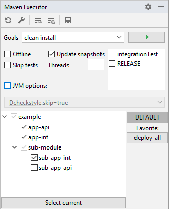

# Maven Executor IntelliJ Plugin

Maven Executor is a plugin for IntelliJ IDEA provides new tool window with maven run parameters. 
It is an alternative for the standard Maven Project Tool Window. 

## Installation
* find plugin using IDEA Brows Repository
* install and restart IDEA
* open Window by *View->Tool Windows->Maven Executor* (window should be visible on the right side) 

## Functionality

### Toolbar Menu
* **Reimport Maven Projects** - standard reimport all maven projects action
* **Open Maven Projects Configuration** - open embedded IDEA maven configuration
* **JVM Options** - dialog window for JVM parameters - one parameter for one line ('\n' is a separator)
* **Environment Variables** - dialog window for Environment Variables
* **Save** - allows to save favorite settings

### Main configuration part
* **Goals** - maven goals to execute
* **Run Button** - run maven with actual goals and parameters
* **Offline** - enable/disable maven *--offline* flag
* **Update Snapshots** - enable/disable *--update-snapshots* flag
* **Threads** - number of thread to run parallel, *-T* option (currently not supported *"thread per cpu"*)
* **Profiles** - list of maven profiles
* **Jvm Options** - optional JVM Options, when checkbox is selected, parameters are added to main JVM parameters (from dialog window)

### Tree of projects
* Tree of checkbox representing structure of maven projects. Each node is maven module. If all nodes are selected, project is build normally.
When only some nodes are selected, project is build with *--projects* option. In both case, order of building modules is calculated by Maven Reactor. 

### Favorite part
* **DEFAULT** - it is label to default settings - always available
* **Favorite** - list of shortcut to saved settings, every change is immediately saved  

### Select Current button
* Select module by current open files (open, not selected and visible in editor Tab)